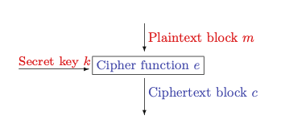
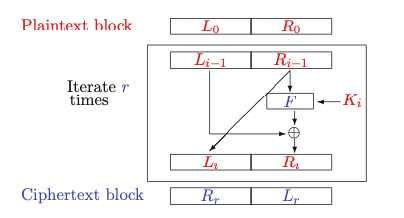

# Block Chipers

 

## Operation of block cipher
- block of plaintext and ciphertext assumed to be of the same size
- n bits in the domain should map to a string of n bits in the codomain
- for a fixed key a block cipher is bijective and hence is a permutation
- 64 bits in DES and 128 bits or more in modern block ciphers
- family of pseudo-random permutations (PRPs)
- is not an encryption scheme; it is a building block to create an encryption scheme
- good block cipher should contain non-linear components

$$
c ← e_{k}(m) \\
m ← d_{k}(c)
$$

#### Block cipher examples:
- AES (resist differential cryptanalysis)
- CAMELLIA
- DES (data encryption standard) (resist differential cryptanalysis)
    - This was because both the block length (64 bits) and the key length (56 bits) of basic DES were too small for new applications
- 3DES

Came out from NIST:
- MARS from a group at IBM,
- RC6 from a group at RSA Security,
- Twofish from a group based at Counterpane, UC Berkeley and elsewhere,
- Serpent from a group of academics based in Israel, Norway and the UK
- Rijndael from a couple of Belgian cryptographers

Attacks:
- Exhaustive search (brute force)
- Meet in the middle attack
- Differential Cryptanalysis:
    - ciphertext pairs. By analysing the probabilities of the differentials computed in a chosen plaintext attack one can hope to reveal the underlying structure of the key.
- Linear Cryptanalysis:
    - Again the goal is to use a probabilistic analysis to determine information about the key.

 

## Feistel Ciphers and DES
The interesting property of a Feistel cipher is that the round function is invertible regardless of the choice of the function in the box marked F

- the same code/circuitry can be used for the encryption and decryption functions
- 

We still need to take care with
- how the round keys are generated
- how many rounds to take
- how the round function F is defined

