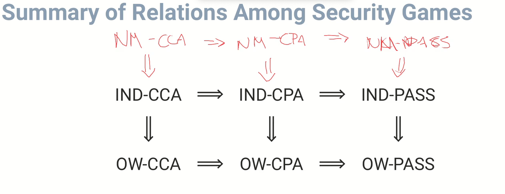
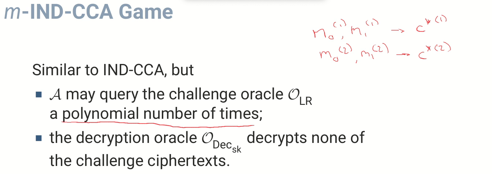
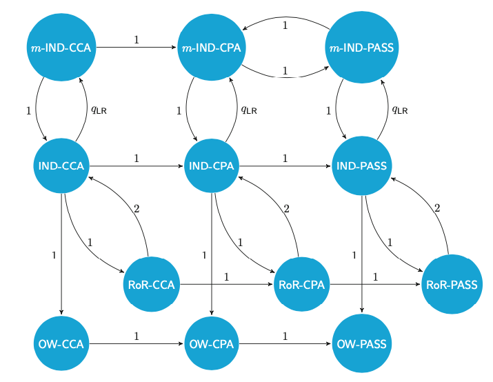

# Defining Security

Modern cryptography:
- definitions: 
    - mathematical definition of what it means for a particular cryptographic mechanism to be secure
- schemes: 
    - specific cryptographic mechanism
- proofs:
    - the design meets the security definition

## Security Requirements
|                                      |                                                                                                        | 
|--------------------------------------|--------------------------------------------------------------------------------------------------------|
| Security Game                        | Definition of interactions between an algorithm attacking the cryptosystem and one of two experiments. | 
| Experiment                           | Describing either the “ideal” or “real” cipher.                                                        | 
| Adversary                            | An algorithm 𝓐 attacking the cryptosystem in the security game.                                       |
| Winning Condition of a Security Game | The adversary wins the security game if it can tell which experiment it is playing.                    |

## Computationally Securee
Informally, a cryptographic system is called computationally secure if the best possible algorithm for breaking it requires N operations, where N is such a large number that it is infeasible to carry out this many operations.

Hence, in practice we say a system is computationally secure if the best known algorithm for breaking it requires an unreasonably large amount of computational resources.

## Computationally Secure Scheme
Adversary whose computational resources are bounded.
- key sizes: small then our adversary may have enough computational resources to break the system.

- At some point in the future we should expect our system to become broken, either through an improvement in computing power or an algorithmic breakthrough

## Perfect Security / Information-theoretic security / Unconditional Security
No limit on the computational power of the adversary
Cannot be broken even with infinite computing power

Not Computational Secure:
- Shift cipher
- Substitution cipher
- Vigen`ere cipher
- Enigma machine

Computationally secure but NOT unconditionally secure
- DES and AES
- RSA
- ElGamal encryption

Unconditionally Secure
- OneTime Pad: but only if is used correctly

- Let $P$ denote the set of possible plaintexts
- Let $K$ denote the set of possible keys
- Let $C$ denote the set of ciphertexts

### Perfect Secrecy
A cryptosystem has perfect secrecy if $ p(P=m | C=c) = p(P=m) $ for all plaintexts m and all ciphertexts c.

#### Bayes Theorem
We want to know the probability of a given message occurring given only the ciphertext.
Utilize Bayes:
$$ p(P=m | C=c) = \frac{p(P=m) * p(C=c|P=m)}{p(C=c)} $$

Important:
- Assume the cryptosystem is perfectly secure, then: #K ≥ #C ≥ #P
- First note that in any encryption scheme, we must have #C ≥ #P

(Shannon) Then the cryptosystem provides perfect secrecy if and only if
- Every key is used with equal probability 1/#K,
- For each $m ∈ P$ and $c ∈ C$ there is a unique key $k$ such that $e_{k}(m) = c$.

**Modified Shift Cipher**
Add a given letter (the key) to each letter of the plaintext to obtain the ciphertext. Using a different key for each plaintext letter. By Shannon’s Theorem this modified shift cipher is perfectly secure.

 

## Negligible
wikipedia:
Noticeable and negligible functions are used to characterize how “large” a function representing a probability is. Intuitively, a noticeable function is one which is at most polynomially small, whereas a negligible function must be exponentially small (more accurately, it must be smaller than any polynomial function)

A function $𝑓$ is negligible, if, for every positive integer $𝑐$ there exists an $𝑁_{𝑐}$ such that for all $𝑥 > 𝑁_{𝑐}$ we have
$$ \big| f(x) \big| \leq \frac{1}{X^{c}} $$

Function 𝑓 decreases faster than any polynomial.

 

## Pseudo-random Functions: Scheme Definition
- Encryption 
- Decryption 
- Key generation

 

### One Way–Passive Attack (OW-PASS)
$$
𝑘 \leftarrow KeyGen(1^{\lambda}) \\
m \leftarrow^{R} P \\
c = F_{k}(m) \rightarrow \Alpha \\
m' \leftarrow \Alpha \\
\Alpha wins if m = m' \\
$$

## Pseudo-random Functions and Permutations (PRF)
A PRF is a function which appears to be random to the adversary; in other words the adversary cannot predict its output.

 

### Security Game
Goal is to guess whether the adversary is given a real pair associated with the PRF function, or a random pair

The advantage of the adversary in winning the game is:
$$ \Big| Pr \big[ \Alpha^{\mathscr{O}_{F_{k}}} wins \big] - \frac{1}{2} \Big| $$

Problem with OW security games:
- A only wins if it learns m completely
- A might learn properties of m but still lose the game
- A scheme is secure if the advantage of any probabilistic polynomial time (ppt) adversary is negligible

Better Security Games:
- Perfect Security (information-theoretic security)
- Semantic security (simulation-based security)
    - hard to prove
- Indistinguishably security (polynomial security)
    - more convenient to prove

- Page Book 199

 

## Pseudo-random permutation (PRP)
In this concept the domain and codomain are the same set D, and the function is one-to-one. Since an adversary can tell a PRF from a PRP if she discovers that the function is not one-to-one

- Page Book 200

Difference between PRP and PRF:
For this we mean that the adversary behaves differently; but the only thing the adversary does is output a bit b'. Thus we can think of telling the difference as meaning that there will be some difference in the advantage of the adversary A in one game compared to the other. Thus we want to bound

 

## One-Way Functions and Trapdoor One-Way Functions
We give the adversary a public function (in this case the function f(x) = gx) and ask her to invert the function on an element of the challenger’s choosing.

- Page Book 201

 

## Public Key Cryptography
- Page Book 203

 

## Security of Encryption
Symmetric key and public key encryption algorithms:
- the goal of the adversary:
    - the winning condition of an analogue of the games considered
- the types of attack allowed
    - which oracles we allow the adversary to access
- the computational model
    - 

 

## Basic Notions of Security
**OW-PASS:** (One Way - Passive Attack)
We call $c^{*}$ the challenge ciphertext and such an attack is called a passive attack

**OW-CPA**  (One Way - Chosen Plaintext Attack)
Thus it is usually the case that the minimum security game also gives the adversary access to an encryption oracle, on plaintext

- OW-PASS and OW-CPA are equivalent in public key setting
- Page Book 204

## Modern Notions of Security
Three notions of security which we need to understand:
- Perfect security:
    - if an adversary with infinite computing power can learn nothing about the plaintext given the ciphertext. Shannon’s Theorem

- Semantic security:
    - perfect security but we only allow an adversary with polynomially bounded computing power. Formally, for all probability distributions on the message space, whatever an adversary can compute (in polynomial time) about the plaintext given the ciphertext, should also be able to compute without the ciphertext.

- IND security (short for INDistinguishability of encryptions), a.k.a. polynomial security
    - Polynomial security, sometimes called indistinguisha- bility of encryptions, or IND security for short,

- Security game for symmetric key OW-CCA
- Security game for public key OW-CCA

Let Π be a symmetric encryption scheme, then we have the following implications  
$ Π \ is \ IND-CCA \ =⇒ \ Π \ is \ IND-CPA \ =⇒ \ Π \ is \ IND-PASS $  
$ Π \ is \ IND-XXX \ =⇒ \ Π \ is \ OW-XXX \ $   

- Page Book 208

- 

 

- Many Time Security:
In the IND game, if we allow the adversary to call the $O_{LR}$ oracle many times then we denote the notions by $Adv_{Π}^{m-IND-PASS(A)}$ etc  
$ Π is m-IND-XXX =⇒ Π is IND-XXX $  

- 

 

- Real-or-Random:
In the real-or-random security game the $O_{LR}$ oracle is replaced with an $O_{RoR}$ oracle. This oracle either encrypts the asked for message (when b = 1) or it encrypts a random message of the same length (when b = 0).

- Lunchtime Attacks
- Nonce-Based Encryption
- Data Encapsulation Mechanisms
- Non-malleability
- Plaintext Aware

 

- 

 

## Message Authentication Codes
use the shared secret key and a keyed algorithm to produce a tag, or MAC, which is sent with the data.
$$ tag = Mac_{k}(m) $$

Note we do not assume that the message is secret: we are trying to protect data integrity and not confidentiality. 

Important Algorithms:
- $ t ← Mack(m) $  
- $ Verifyk(t,m) = valid $  

 

## Digital Signature Schemes
Invented by Diffie and Hellman. Digital signature scheme with appendix.
$$ Message + Alice’s private key = Signature $$ 
$$ Message + Signature + Alice’s public key = YES/NO.$$
A digital signature scheme consists more formally of two algorithms:
- A signing algorithm S which uses a secret key sk, $s ← Sig_{sk}(m)$
- A verification algorithm V which uses a public key pk. $ Verify_{pk}(Sig_{sk}(m), m) = valid$

 

## Security Definitions for MACs and Digital Signatures:
There are two main properties:
- message integrity – the message has not been altered in transit
- message origin – the message was sent by Alice
- non-repudiation – Alice cannot claim she did not send the message
    - consider what would happen if you could sign a cheque and then say you did not sign it.

Forger:
Adversary against a MAC or signature algorithm

The three main types of forgery are:
- Total Break: 
    - forger can produce MACs/signatures just as if he were the valid key holder

- Selective Forgery:
    - forge a MAC/signature on a single message of the challenger’s choosing
    - i.e. decrypt a message but not recover the private key like OW security

- Existential Forgery:
    - forge a MAC/signature on a single message of the adversary’s choosing

### UEF-CMA (Existentially UnForgable against a Chosen Message Attack)
A MAC/signature scheme is deemed to be secure if it is infeasible for an adap- tive adversary to produce an existential forgery. We call this notion EUF-CMA, for Existentially UnForgable against a Chosen Message Attack.

 

## Bit Security
$$ F_{N,e}: x \rightarrow y=x^{e} (mod N) $$

We would like it to be true that computing even this single bit of information about x is as hard as computing all of x. In other words we wish to study the so-called bit security of the RSA function. 

## Hard Predicates for the RSA Problem
The RSA problem, namely given $c = m^{e} (mod N)$ has the following three hard predicates: 
- $B_{1}(m) = m (mod \ 2)$
- $B_{h}(m)= 0 \ if \ m \ \le \ \frac{N}{2} \ otherwise \ B_{h}(m)=1$
- $B_{k}(m) = m \ (mod \ 2^{k}) \ where \ k = O(log(log N))$

 

## Computational Models: The Random Oracle Model (ROM)
We provide all parties, the challenger and the adversary, with a random function with domain {0,1}∗ and a finite codomain C

- $O_{H}$ function cannot exist in the real world, as it would take infinite space to represent
- The adversary makes no use of knowledge of the real unkeyed cryptographic hash function
- Hash functions are sometimes used in other cryptographic schemes
- Hash function $H: {0,1}^{*} \rightarrow C$ complicates the proofs of the schemes
- Allows us to prove secure various schemes used in the real world

 

